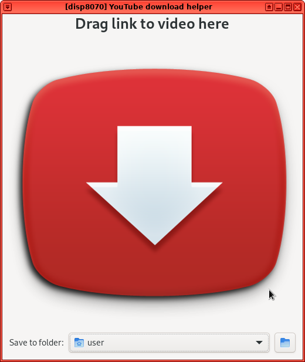

# YouTube download helper

Drag and drop URLs from your browser to this application to download YouTube
videos using `youtube-dl` or `yt-dlp`.

  

Requires `youtube-dl` or `yt-dlp` installed in your system and in your `PATH`.

## Installation

### Directly from PyPI

Ensure your system has GTK+ 3, libnotify 0.7, the VTE library, and either
`yt-dlp` or `youtube-dl`.

You can then install on your system by using `pip3 install youtube-dl-helper`.

### As an RPM package (Fedora / Red Hat)

To build a package you can install on your system: `python3 setup.py bdist_rpm`.
The RPM will then be created on the system, and you can install it using
`dnf install path/to/youtube-dl-helper*rpm`.
